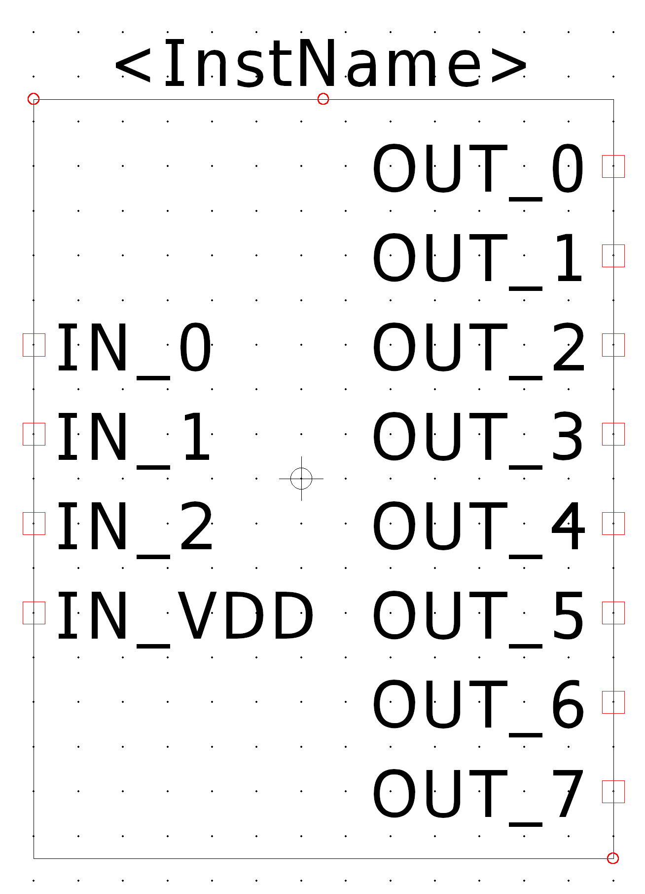

<h3 align="center" style="margin-top: 50px;">Функциональная схемотехника</h3>
<h3 align="center">Отчёт по лабораторной работе №1</h3>
<h3 align="center">Введение в проектирование цифровых интегральных схем</h3>

<h3 align="center">Вариант 6</h3>

<h3 align="left" style="margin-left: 50px; margin-top: 150px;">Выполнили: </h3>
<h3 align="left" style="margin-left: 50px; margin-top: 150px;">Бутвин Михаил Павлович, P3330</h3>
<h3 align="left" style="margin-left: 50px; margin-top: 150px;">Хабнер Георгий Евгеньевич, P3331</h3>

<h3 align="center" style="margin-top: 350px;">СПб – 2024</h3>
<!-- </body> -->

<div style="page-break-after: always;"></div>


## Цели работы

1. Получить базовые знания о принципах построения цифровых интегральных
схем с использованием технологии КМОП.
2. Познакомиться с технологией SPICE-моделирования схем на транзисторах.
3. Получить навыки описания схем базовых операционных элементов (БОЭ) комбинационного типа на вентильном уровне с использованием языка описания
аппаратуры Verilog HDL


## Часть 1


### Схема вентиля И-НЕ


### Символ вентиля И-НЕ и схема тестирования


### Временная диаграмма работы схемы тестирования вентиля


### Максимальная частота работы вентиля


$t_pd = |5.015 - 5.385|ns = 0.37ns \implies T_max \le 0.37 \dot 3 ns \implies V_max = 1.351GHz$

### Схема дешифратора 3 в 8


### Символ дешифратора и схема тестирования




### Временная диаграмма процесса тестирования


### Максимальная частота работы


$t_pd = |8.105 - 8.585|ns = 0.48ns \implies T_max \le 0.48 \dot 2 ns \implies V_max = 793MHz$

## Часть 2

### Разработанный модуль, реализующий дешифратор 3 в 8

```verilog
`define decoder_block(i, a, b, c) \
    nand(x[i], a, b); \
    nand(y[i], x[i], x[i]); \
    nand(z[i], y[i], c); \
    nand(d[i], z[i], z[i]);

module decoder (
    output wire [7:0] d,
    input wire a,
    input wire b,
    input wire c
);
    wire A, B, C;

    nand(A, a, a);
    nand(B, b, b);
    nand(C, c, c);

    wire [7:0] x, y, z;

    `decoder_block(0, A, B, C);
    `decoder_block(1, A, B, c);
    `decoder_block(2, A, b, C);
    `decoder_block(3, A, b, c);
    `decoder_block(4, a, B, C);
    `decoder_block(5, a, B, c);
    `decoder_block(6, a, b, C);
    `decoder_block(7, a, b, c);
endmodule
```

### Тестовое окружение

```verilog
`timescale 1ps/1ps


module decoder_tb ();
    reg a_in, b_in, c_in;
    wire [7:0] d_out;

    decoder decoder_0(
        .d(d_out),
        .a(a_in),
        .b(b_in),
        .c(c_in)
    );

    integer i;
    reg [2:0] test_in;
    reg [7:0] expected_out;

    initial begin
        for (i = 0; i < 8; i = i + 1) begin
            test_in = i;
            c_in = test_in[0];
            b_in = test_in[1];
            a_in = test_in[2];
            expected_out = 0;
            expected_out[i] = 1;

            #1

            if (d_out == expected_out) begin
                $display("PASS: decoder(%b, %b, %b) == %b == %b", a_in, b_in, c_in, d_out, expected_out);
            end else begin
                $display("  FAIL: decoder(%b, %b, %b) == %b != %b", a_in, b_in, c_in, d_out, expected_out);
            end
        end
        #1 $stop;
    end
endmodule
```

### Результат моделирования

```
PASS: decoder(0, 0, 0) == 00000001 == 00000001
PASS: decoder(0, 0, 1) == 00000010 == 00000010
PASS: decoder(0, 1, 0) == 00000100 == 00000100
PASS: decoder(0, 1, 1) == 00001000 == 00001000
PASS: decoder(1, 0, 0) == 00010000 == 00010000
PASS: decoder(1, 0, 1) == 00100000 == 00100000
PASS: decoder(1, 1, 0) == 01000000 == 01000000
PASS: decoder(1, 1, 1) == 10000000 == 10000000
decoder_tb.v:36: $stop called at 9 (1ps)
```


## Вывод

В этой работе мы изучили принципы построения цифровых схем на КМОП-технологии и выполнили SPICE-моделирование, чтобы понять работу элементов на транзисторном уровне.
Мы также описали модель на языке Verilog HDL и создаи тестовые окружения для проверки ее функциональности.
Мы спроектировали и протестировали вентиль И-НЕ и дешифратор 3 в 8.
Для достижения стабильной работы схемы важно было учесть временный задержки.
